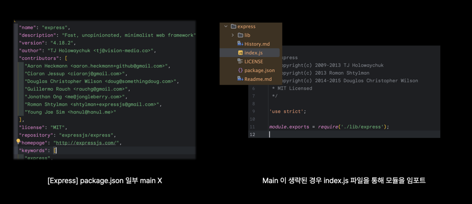

# Node.js

> [Node.js](https://developer.mozilla.org/en-US/docs/Glossary/Node.js)를 필사하고 작성된 내용이다.

Node.js a cross-platform JavaScript runtime environment that allows developers to build server-side and network
application with JavaScript.

> Node.js는 개발자가 서버 사이드 및 네트워크 응용 프로그램을 만들 수 있도록 지원하는 크로스 클랫폼 JavaScript 환경이다.

# Node Package Manager (npm)

npm is a package manager that is downloaded and bundled alongside Node.js.

> npm은 Node.js와 함께 다운로드 되어 번들로 제공되는 패키지 매니저다.

Its command-line (CLI) client `npm` can be used to download, configure and create packages for use in Node.js projects.

> Node.js 프로젝트에서 CLI 클라이언트 npm을 사용하여 패키지를 다운로드, 구성 및 생성할 수 있습니다.

Downloaded package can be imported by ES imports and CommonJS `require()` without including the dependency directory
`node_modules/` they are downloaded to, as Node.js resolves packages without a relative or absolute path specified
in there import.

> 다운로드한 패키지는 종속성 디렉토리(node_modules)를 포함하지 않고 ES imports와 CommonJS로 가져올 수 있다.가져올 수 있다.
> Node.js는 패키지를 가져올 때 지정된 상대, 절대 경로 없이 패키지를 확인한다.

Packages hosted on npm are downloaded from the registry at https://registry.npmjs.org/ but the CLI can be configured to
use any compatible instance.

> npm에서 호스팅 되는 패키지는 레지스트리(https://registry.npmjs.org/)에서 다운로드 되지만, 호환되는 인스턴스를 사용하도록 CLI를 구성할 수 있다.

## 모듈 해석 메커니즘

> as Node.js resolves packages without a relative or absolute path specified in there import.

Node.js의 모듈(패키지) 가져오는 방식을 이해하지 못했기에 해당 문장이 이해할 수 없었다.

```typescript
import express from 'express'; // ES import
const express = require('express'); // CommonJS 
```



1. 내장 모듈: Node.js의 내장 모듈 중 하나인지를 확인한다. 예) `http`, `fs`
2. node_modules 폴더 탐색: 패키지 이름만 명시된 경우, Node.js는 현재 파일의 위치를 시작하여 상위 디렉토리로 접근하여 최종적으로 `node_modules` 폴더를 탐색하여 일치하는 디렉토리를
   찾는다. 찾은 후에 `express/package.json` 파일 내의 `main` 필드를 확인하여 모듈의 진입점을 확인, 해당 파일을 로드한다.

## 📝 단어장

* dependency: 종속성
* resolves: 해결하다. 확인하다.

